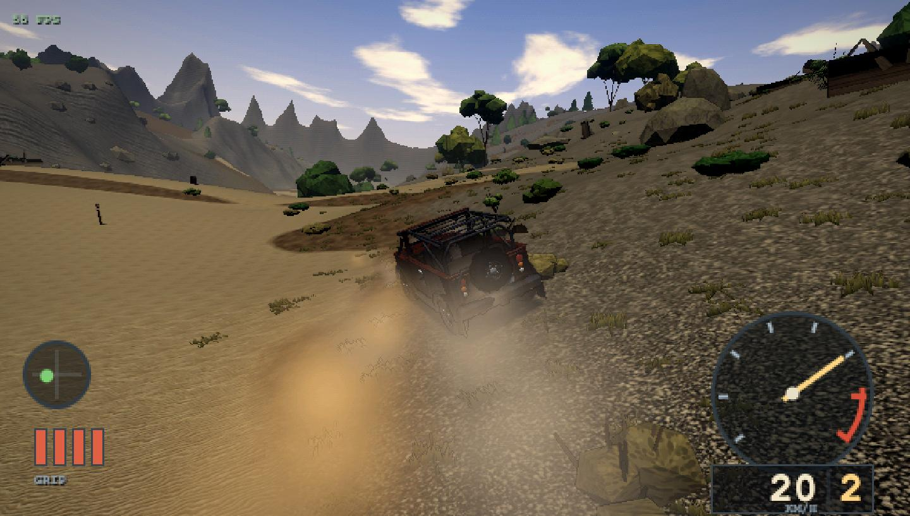

# Rally Adventure

An off-road driving game in the browser. Three.js, TypeScript and Rapier, with
a deliberately retro look — low internal resolution, ordered dithering, crisp
texels — built to the visual standard of **Screamer 4x4 (Milestone, 2000)**.

Everything is generated in code. There are no art assets: the terrain, every
texture, the Jeep, the vegetation and the entire soundtrack of engine, tyre and
suspension noise are synthesised at load time.



## Run it

```
npm install
npm run dev          # http://127.0.0.1:5183
```

**WASD** drive · **SPACE** handbrake · **C** camera · **R** recover ·
**T** time of day · **P** retro pipeline · **V** record video ·
**H** controls · **F3** frame counter

## What's in it

**Vehicle physics.** A custom raycast vehicle on a Rapier rigid body — not
Rapier's built-in controller, whose tire model is too crude for this. Sphere
shapecast wheels, progressive springs with bump stops, separate bump and rebound
damping, anti-roll bars, a combined-slip Pacejka tire model with load
sensitivity, per-surface friction, and a 4WD drivetrain with limited-slip
differentials and a low-range transfer case. Runs at a fixed 120 Hz with
interpolated rendering.

Measured, not asserted: 0–100 km/h in 11.99 s, 155 km/h top speed, 30.2 m from
80 km/h on dirt, 0.68 lateral g.

**Terrain.** A 1024 m seeded world with hand-placed jump crests, a banked bowl,
a dry wash, a rocky chatter section and a 25.6° climb, layered with fractal
noise and hydraulic and thermal erosion. Five-layer splat material with
height-based blending, triplanar cliffs and baked occlusion. The visual mesh and
the Rapier heightfield collider agree to **0.12 mm**.

**Rendering.** Scene rendered at low internal resolution, then bloom, god rays,
height-aware fog, a procedural grade LUT, palette quantisation with Bayer
dithering, nearest upscale, vignette. Sky, fog and lighting are driven from one
shared atmosphere state so the horizon never seams.

**Audio.** No samples. An `AudioWorklet` synthesises combustion directly —
a firing clock at `rpm/20` Hz for a four-stroke six, each firing injecting
shaped impulses through exhaust and intake resonators, with per-cylinder timing
jitter. The body envelope shortens under load, so the load-to-timbre
relationship falls out of the physics rather than a filter sweep.

**Also:** ecological instanced scatter with impostor LODs and wind, GPU
particles for dust and debris driven by per-wheel slip, persistent tyre tracks,
and a free-roam objective layer.

## Verification

```
npm run typecheck

npx esbuild src/physics/vehicle.test.ts --bundle --platform=node --format=esm \
  --outfile=/tmp/vt.mjs --log-level=error && node /tmp/vt.mjs      # 81/81
npx esbuild src/world/terrain.test.ts --bundle --platform=node --format=esm \
  --outfile=/tmp/tt.mjs --log-level=error && node /tmp/tt.mjs      # 53/53
```

Both harnesses run headless, without a browser or GPU, and print the measured
numbers beside each check rather than just pass/fail.

Art quality is judged by blind comparison: `tools/blind-compare.mjs` composites
a screenshot beside real reference shots with the sides randomised, and a fresh
reviewer that has not seen the answer key picks the better image. Current
standing is **4–0** against Screamer 4x4.

## Documentation

| | |
|---|---|
| `CLAUDE.md` | invariants and traps — read before changing rendering or vehicle code |
| `docs/ART_DIRECTION.md` | sampled palette, quality bar |
| `docs/TOOLS.md` | preview pages, harnesses, CLI tools |
| `reference/SOURCES.md` | the reference corpus and why it isn't committed |

## Licence

Not yet chosen. All code is original; there are no third-party assets in the
repository.
